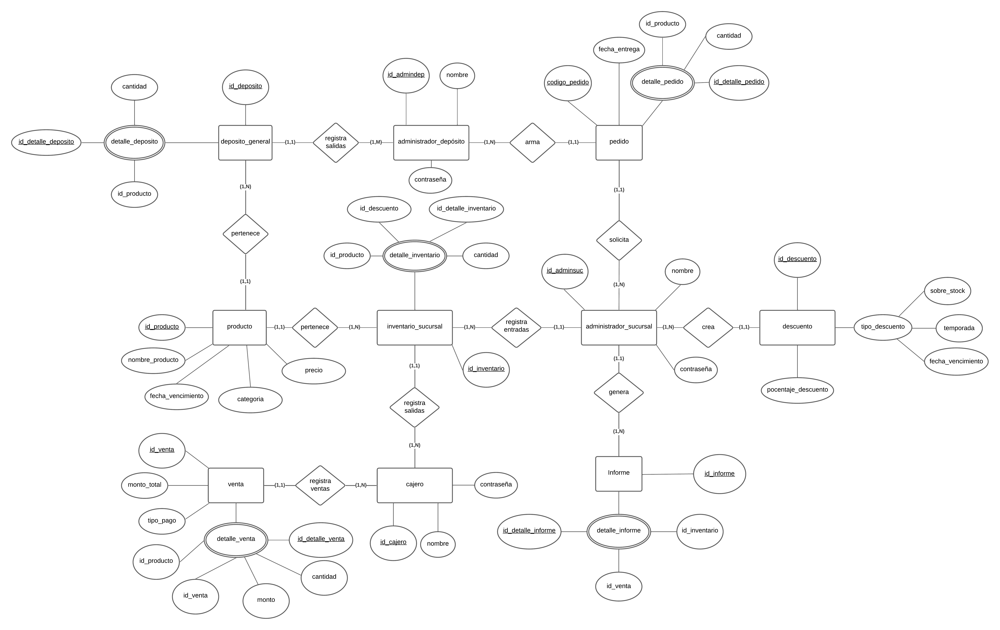
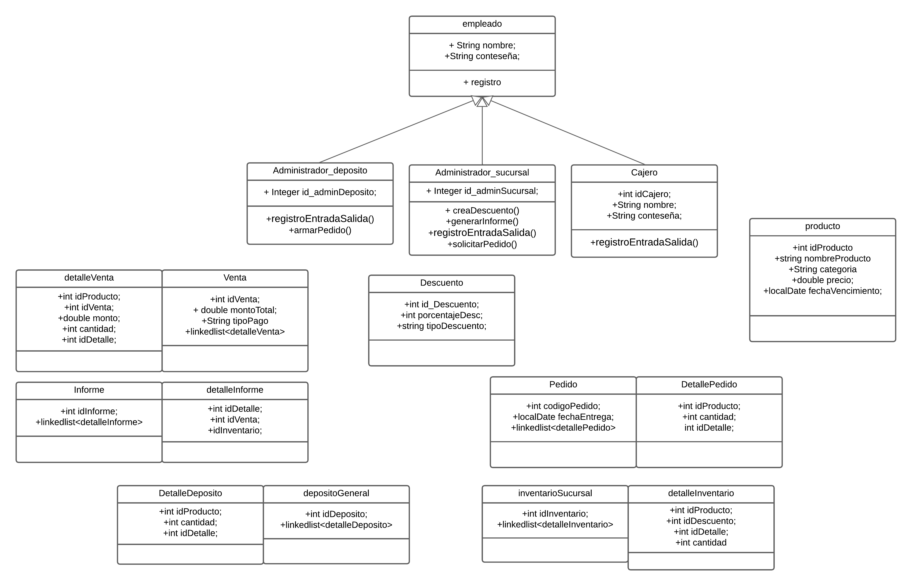
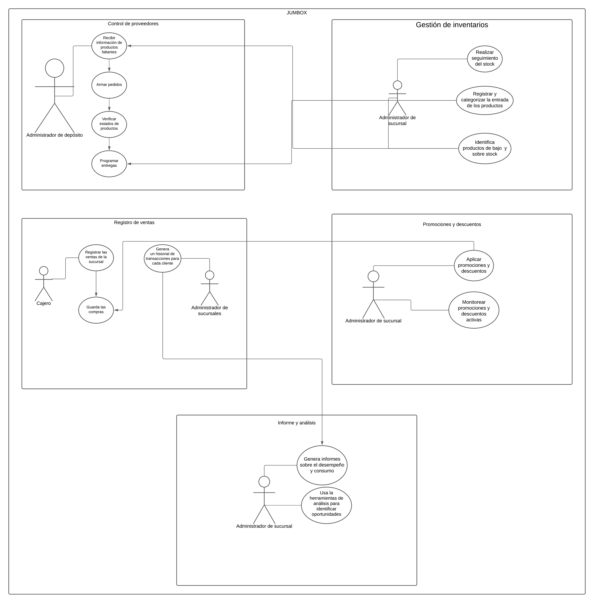

<!DOCTYPE html>
<html lang="en">
<head>
    <meta charset="UTF-8">
    <meta name="viewport" content="width=device-width, initial-scale=1.0">
</head>
<body>
    <h1>JUMBOX - SUPERMERCADO</h1>
    <h2>SRS(Especificación de requisitos)</h2>
    <a href="https://docs.google.com/document/d/1w_qEuUtHDcTaklRvwdihYMyGGhndH649JtvnWkO6w-4/edit" target="_blank">Ver Documento SRS</a>
    <h2>Diagrama Entidad - Relación</h2>
    
    <h2>Diagrama de Clases</h2>
    
    <h2>Diagrama de Casos de Uso</h2>
    
</body>
</html>
